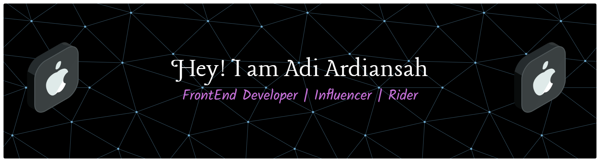

### Hello world👋

<!--
**Adiardiansah/Adiardiansah** is a ✨ _special_ ✨ repository because its`README.md` (this file) appears on your GitHub profile.

Here are some ideas to get you started:

- 🔭 I’m currently working on ...
- 🌱 I’m currently learning ...
- 👯 I’m looking to collaborate on ...
- 🤔 I’m looking for help with ...
- 💬 Ask me about ...
- 📫 How to reach me: ...
- 😄 Pronouns: ...
- ⚡ Fun fact: ...
-->

- 🔭 I’m currently working on No Jobs Means im still jobless still🤣
- 🌱 I’m currently learning Something that makes me grow up
- 💬 Ask me about Everything

##### Connect with me
 

##### I'm Interested in 

   

###### Thank u so much for ur attention of me 